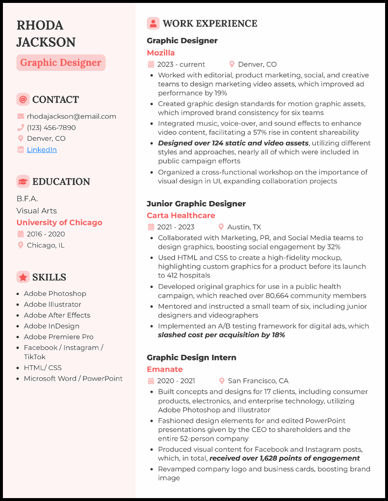
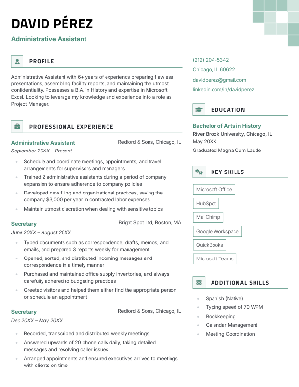
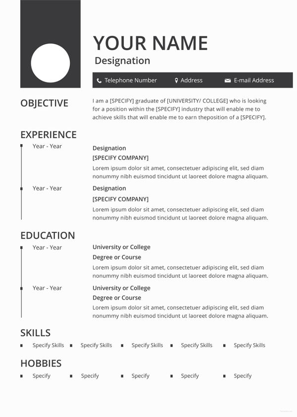

# CVBuild

> Ma’lumotlaringizni bir joyga jamlang, zamonaviy CV yarating va uni PDF formatida yuklab oling.

<p align="center">
  <a href="https://drive.google.com/file/d/1S2R4MPZV0g_aTODjm6omEcALeJt2bjqT/view?usp=sharing">
    
  </a>
</p>

<p align="center">
  <a href="https://drive.google.com/file/d/1S2R4MPZV0g_aTODjm6omEcALeJt2bjqT/view?usp=sharing">
    
  </a>
</p>

<p align="center"><i>Yuqoridagi tugma yoki preview rasmini bosing — ilova videosi/preview’i Google Drive’da ochiladi.</i></p>

## Loyiha haqida

CVBuild — ish qidirayotganlar, talabalar va mutaxassislar uchun rezyume tayyorlashni osonlashtiradigan Flutter ilovasi. Foydalanuvchi ma’lumotlarini bosqichma-bosqich kiritadi, tayyor shablonlardan birini tanlaydi va natijani PDF ko‘rinishida saqlaydi.

Ilova quyidagi jarayon asosida ishlaydi:

1. Qisqa onboarding orqali ilova imkoniyatlari bilan tanishish.
2. Rezyume ma’lumotlarini bosqichma-bosqich kiritish.
3. O‘zingizga mos CV shablonini tanlash.
4. Tayyor rezyumeni ko‘rib chiqish va PDF sifatida yuklab olish.

## Kiritiladigan ma’lumotlar

- Ism-familiya va mutaxassislik
- Bog‘lanish ma’lumotlari: email, telefon raqami, GitHub va LinkedIn
- Yashash manzili
- Mutaxassislikka mos ko‘nikmalarni chiplar orqali bir nechta tanlash
- Tillar
- Sertifikatlar
- Tarjimai hol / professional profil
- Ish tajribasi: tashkilot, muddat, lavozim va bajarilgan ishlar
- Loyihalar: loyiha tavsifi, sana, rol (`Lead` yoki `Assistant`) va bajarilgan ishlar
- Ta’lim ma’lumotlari

## Asosiy imkoniyatlar

| Imkoniyat | Foydalanuvchi uchun foydasi |
| --- | --- |
| Bosqichma-bosqich forma | Katta formani qismlarga bo‘lib, to‘ldirishni yengillashtiradi |
| Mutaxassislikka mos skills | Kerakli ko‘nikmalarni tez tanlash va qo‘shimcha skill kiritish imkoniyati |
| Bir nechta CV shabloni | Turli kasb va uslublar uchun mos dizayn tanlash |
| PDF preview | Yuklab olishdan oldin tayyor hujjatni ko‘rish |
| PDF export | Rezyumeni qurilmaga saqlash va ish beruvchiga yuborish |
| Draft saqlash | To‘ldirilgan ma’lumotlarni lokal qurilmada saqlab, keyin davom ettirish |

## Shablonlar preview’i

Quyidagi rasmlar CVBuild’da ishlatiladigan resume dizaynlariga misol bo‘la oladi. Rasmni bosib ilova preview’ini ko‘ring.

<p align="center">
  <a href="https://drive.google.com/file/d/1S2R4MPZV0g_aTODjm6omEcALeJt2bjqT/view?usp=sharing">
    
  </a>
  &nbsp;&nbsp;
  <a href="https://drive.google.com/file/d/1S2R4MPZV0g_aTODjm6omEcALeJt2bjqT/view?usp=sharing">
    
  </a>
</p>

## Texnologiyalar

- [Flutter](https://flutter.dev/)
- Dart
- `shared_preferences` — draft va CV ma’lumotlarini lokal saqlash
- `pdf` — PDF hujjat yaratish
- `printing` — PDF preview va print bilan ishlash
- `file_picker` — fayl bilan ishlash

## Loyihani ishga tushirish

### Talablar

- Flutter SDK
- Dart SDK
- Android Studio yoki VS Code
- Android emulatori yoki USB debugging yoqilgan Android qurilma

### O‘rnatish

```bash
git clone <repository-url>
cd cvbuild
flutter pub get
flutter run
```

Android APK yaratish uchun:

```bash
flutter build apk --release
```

Tayyor APK quyidagi manzilda hosil bo‘ladi:

```text
build/app/outputs/flutter-apk/app-release.apk
```

## Testlarni ishga tushirish

```bash
flutter test
```

## Loyiha tuzilmasi

```text
lib/
├── app/                 # Ilova konfiguratsiyasi, router va theme
├── core/                # PDF, storage va file servislar
└── features/
    ├── onboarding/      # Ilova bilan tanishtirish oynalari
    ├── home/            # CV lar bosh sahifasi
    ├── resume/          # Rezyume formasi va ma’lumotlar modeli
    ├── templates/       # CV shablonlarini tanlash
    └── preview/         # PDF preview va yuklab olish
```

## Muallif

CVBuild — zamonaviy va tartibli rezyume yaratishni sodda qilish uchun ishlab chiqilgan loyiha.

Taklif yoki xatolik topsangiz, GitHub Issues orqali xabar qoldiring.
